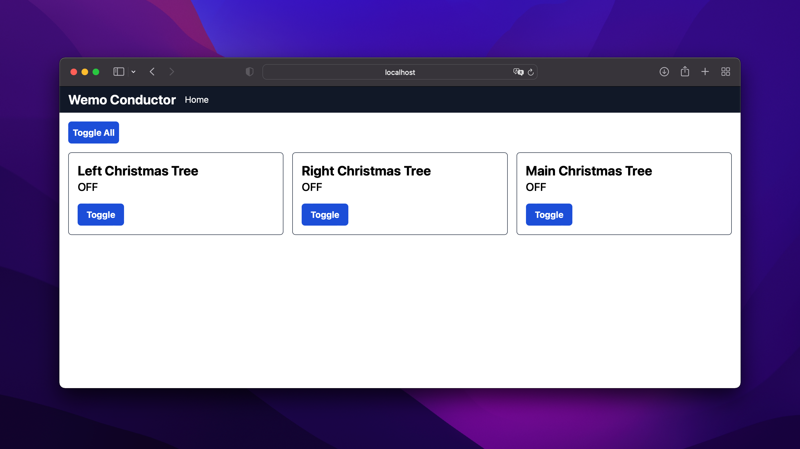

# wemo-conductor

Wemo Conductor is an open-source web control panel for Wemo Smart Plugs.

## Features

- Toggle all smart plugs at once
- Toggle individual smart plugs
- Gets the friendly name of the smart plugs

## Setup

1. Do a `yarn install`
2. Create a file named `switches.json` in the root of the directory. Have it laid out like this:
```json
[
  ["wemo ip", "wemo port (as number)"]
]
```
3. Run `node server`

## Screenshots



## License

MIT